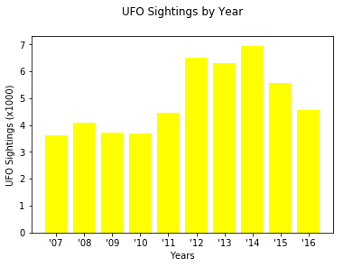
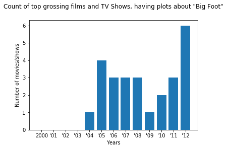
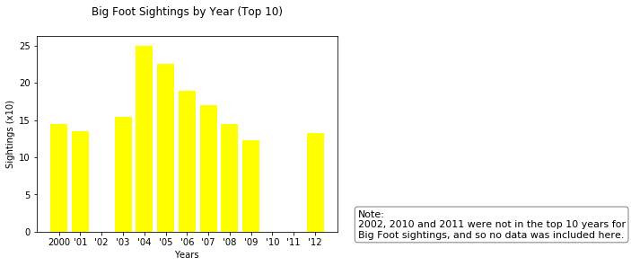

```python
%matplotlib inline
import pandas as pd
import json
import requests
import matplotlib.pyplot as plt
from matplotlib import pylab
import seaborn as sns
import numpy as np
from config import api_key
```


```python
titles = []
release_dates = []
overview = []
```


```python
for x in range(6):
    url = "https://api.themoviedb.org/3/discover/movie?&sort_by=revenue.desc&api_key="+api_key+"&page="+str(x+1)+"&with_keywords=2597|227007"
    response = requests.get(url)
    data = response.json() 
    for y in range(len(data["results"])):
        titles.append(data["results"][y]["title"])
        release_dates.append(data["results"][y]["release_date"])
        overview.append(data["results"][y]["overview"])
```


```python
url_tv = "https://api.themoviedb.org/3/discover/tv?&api_key="+api_key+"&page="+str(x+1)+"&with_keywords=2597|227007"
response_tv = requests.get(url_tv)
data_tv = response_tv.json() 
for x in range(len(data_tv["results"])):
    titles.append(data_tv["results"][x]["name"])
    release_dates.append(data_tv["results"][x]["first_air_date"])
    overview.append(data_tv["results"][x]["overview"])
```


```python
#print(len(titles))
```


```python
years = []
months = []
for x in range(len(release_dates)):
    try:
        y = release_dates[x]
        year = y.split("-")[0]
        month = y.split("-")[1]
        years.append(year)
        months.append(month)
    except:
        years.append("")
        months.append("")
```


```python
movie_data = {
    "Titles":titles,
    "Year":years,
    "Month": months,
    "Overview":overview
}

movie_df = pd.DataFrame(data=movie_data)
movie_df.head()
```


<div>
<style scoped>
    .dataframe tbody tr th:only-of-type {
        vertical-align: middle;
    }

    .dataframe tbody tr th {
        vertical-align: top;
    }

    .dataframe thead th {
        text-align: right;
    }
</style>
<table border="1" class="dataframe">
  <thead>
    <tr style="text-align: right;">
      <th></th>
      <th>Month</th>
      <th>Overview</th>
      <th>Titles</th>
      <th>Year</th>
    </tr>
  </thead>
  <tbody>
    <tr>
      <th>0</th>
      <td>06</td>
      <td>Returning from a hunting trip in the forest, t...</td>
      <td>Harry and the Hendersons</td>
      <td>1987</td>
    </tr>
    <tr>
      <th>1</th>
      <td>08</td>
      <td>A documentary-style drama based on true accoun...</td>
      <td>The Legend of Boggy Creek</td>
      <td>1972</td>
    </tr>
    <tr>
      <th>2</th>
      <td>02</td>
      <td>With the ratings dropping for a wilderness-the...</td>
      <td>Strange Wilderness</td>
      <td>2008</td>
    </tr>
    <tr>
      <th>3</th>
      <td>06</td>
      <td>Mark the Lumberjack is a woodsman with a bad t...</td>
      <td>The Lumberjack of All Trades</td>
      <td>2006</td>
    </tr>
    <tr>
      <th>4</th>
      <td>01</td>
      <td>A documentary that explores the existence of B...</td>
      <td>Manbeast! Myth or Monster?</td>
      <td>1978</td>
    </tr>
  </tbody>
</table>
</div>


```python
movie_df.to_csv("bigfoot_movies_tv.csv")
```


```python
year_df = movie_df.groupby(movie_df["Year"],as_index=False)
year_df = year_df["Titles"].count()
year_df = year_df[year_df.Year != ""]
year_df["Year"] = year_df["Year"].astype(int)
```


```python
bins = [0,1959,1969,1979,1989,1999,2000,2001,2002,2003,2004,2005,2006,2007,2008,2009,2010,2011,2012,2013]
bin_labels = ["before 1959","1960s","1970s","1980s","1990s","2000","'01","'02","'03","'04","'05","'06","'07","'08","'09","'10","'11","'12","2013+"]
#print(len(bins))
#print(len(bin_labels))
```


```python
year_df["Decade"] = pd.cut(year_df["Year"],bins,labels=bin_labels)
movies_by_year = year_df.groupby(year_df["Decade"],as_index=False).sum()
movies_by_year
```


<div>
<style scoped>
    .dataframe tbody tr th:only-of-type {
        vertical-align: middle;
    }

    .dataframe tbody tr th {
        vertical-align: top;
    }

    .dataframe thead th {
        text-align: right;
    }
</style>
<table border="1" class="dataframe">
  <thead>
    <tr style="text-align: right;">
      <th></th>
      <th>Decade</th>
      <th>Year</th>
      <th>Titles</th>
    </tr>
  </thead>
  <tbody>
    <tr>
      <th>0</th>
      <td>before 1959</td>
      <td>0</td>
      <td>0</td>
    </tr>
    <tr>
      <th>1</th>
      <td>1960s</td>
      <td>1968</td>
      <td>1</td>
    </tr>
    <tr>
      <th>2</th>
      <td>1970s</td>
      <td>13831</td>
      <td>14</td>
    </tr>
    <tr>
      <th>3</th>
      <td>1980s</td>
      <td>7939</td>
      <td>5</td>
    </tr>
    <tr>
      <th>4</th>
      <td>1990s</td>
      <td>7985</td>
      <td>7</td>
    </tr>
    <tr>
      <th>5</th>
      <td>2000</td>
      <td>0</td>
      <td>0</td>
    </tr>
    <tr>
      <th>6</th>
      <td>'01</td>
      <td>0</td>
      <td>0</td>
    </tr>
    <tr>
      <th>7</th>
      <td>'02</td>
      <td>0</td>
      <td>0</td>
    </tr>
    <tr>
      <th>8</th>
      <td>'03</td>
      <td>0</td>
      <td>0</td>
    </tr>
    <tr>
      <th>9</th>
      <td>'04</td>
      <td>2004</td>
      <td>1</td>
    </tr>
    <tr>
      <th>10</th>
      <td>'05</td>
      <td>2005</td>
      <td>3</td>
    </tr>
    <tr>
      <th>11</th>
      <td>'06</td>
      <td>2006</td>
      <td>3</td>
    </tr>
    <tr>
      <th>12</th>
      <td>'07</td>
      <td>2007</td>
      <td>1</td>
    </tr>
    <tr>
      <th>13</th>
      <td>'08</td>
      <td>2008</td>
      <td>3</td>
    </tr>
    <tr>
      <th>14</th>
      <td>'09</td>
      <td>2009</td>
      <td>1</td>
    </tr>
    <tr>
      <th>15</th>
      <td>'10</td>
      <td>2010</td>
      <td>2</td>
    </tr>
    <tr>
      <th>16</th>
      <td>'11</td>
      <td>2011</td>
      <td>3</td>
    </tr>
    <tr>
      <th>17</th>
      <td>'12</td>
      <td>2012</td>
      <td>6</td>
    </tr>
    <tr>
      <th>18</th>
      <td>2013+</td>
      <td>2013</td>
      <td>1</td>
    </tr>
  </tbody>
</table>
</div>


```python
decades = list(movies_by_year["Decade"])
counts = list(movies_by_year["Titles"])
#print(len(decades))
```


```python
labels = decades[1:5] + decades[9:19]
sizes = counts[1:5] + counts[9:19]
#print(len(labels))
#print(len(sizes))
```


```python
colors = ["darkblue", "yellow", "lightskyblue","purple","red","pink","red","pink","red","pink","red","pink","red","yellowgreen"]
explode = (0, 0, 0, 0, 0.1, 0.1, 0.1, 0.1, 0.1, 0.1, 0.1, 0.1,0.1, 0)
plt.pie(sizes, labels=labels, colors=colors,labeldistance=1.1,explode = explode)
plt.axis('equal')
plt.title("Count of top grossing films and TV shows, having plots about \"Big Foot\", by decade",y=1.08)
textstr = ("Note:\n2004-2012 correspond with the 10 years of highest Big Foot sightings\n(2000-2001, 2003-2009, and 2012).")
props = dict(boxstyle='round', facecolor='white', alpha=0.5)
plt.text(1.5, 0.95, textstr, fontsize=11,verticalalignment='center', bbox=props)
```


    Text(1.5,0.95,'Note:\n2004-2012 correspond with the 10 years of highest Big Foot sightings\n(2000-2001, 2003-2009, and 2012).')





```python
recent_counts = counts[5:18]
recent_years = decades[5:18]
```


```python
plt.bar(recent_years,recent_counts,align="center")
plt.title("Count of top grossing films and TV Shows, having plots about \"Big Foot\", by year",y = 1.08)
plt.xlabel("Years")
plt.ylabel("Number of movies/shows")
plt.show()
```





```python
ufo_sightings = [14.5,13.5,0,15.4,25.0,22.6,18.9,17.0,14.5,12.3,0,0,13.2]
plt.title("Big Foot Sightings by Year (Top 10)",y = 1.08)
plt.xlabel("Years")
plt.ylabel("Sightings (x10)")
plt.bar(recent_years,ufo_sightings,color="yellow",align="center")
textstr = ("Note:\n2002, 2010 and 2011 were not in the top 10 years for\nBig Foot sightings, and so no data was included here.")
props = dict(boxstyle='round', facecolor='white', alpha=0.5)
plt.text(14, 0.95, textstr, fontsize=11,verticalalignment='center', bbox=props)
```


    Text(14,0.95,'Note:\n2002, 2010 and 2011 were not in the top 10 years for\nBig Foot sightings, and so no data was included here.')




