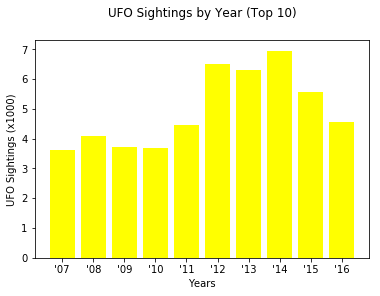

```python
%matplotlib inline
import pandas as pd
import json
import requests
import matplotlib.pyplot as plt
import seaborn as sns
import numpy as np
from config import api_key
```


```python
titles = []
release_dates = []
overview = []

for x in range(6):
    url = "https://api.themoviedb.org/3/discover/tv?&api_key="+api_key+"&page="+str(x+1)+"&with_keywords=9738|9951&without_genres=16,35"
    response = requests.get(url)
    data = response.json() 
    for y in range(len(data["results"])):
        titles.append(data["results"][y]["name"])
        release_dates.append(data["results"][y]["first_air_date"])
        overview.append(data["results"][y]["overview"])
```


```python
#print(len(titles))
```


```python
years = []
months = []
for x in range(len(release_dates)):
    try:
        y = release_dates[x]
        year = y.split("-")[0]
        month = y.split("-")[1]
        years.append(year)
        months.append(month)
    except:
        years.append("")
        months.append("")
```


```python
movie_data = {
    "Titles":titles,
    "Year":years,
    "Month": months,
    "Overview":overview
}

movie_df = pd.DataFrame(data=movie_data)
movie_df.head()
```


<div>
<style scoped>
    .dataframe tbody tr th:only-of-type {
        vertical-align: middle;
    }

    .dataframe tbody tr th {
        vertical-align: top;
    }

    .dataframe thead th {
        text-align: right;
    }
</style>
<table border="1" class="dataframe">
  <thead>
    <tr style="text-align: right;">
      <th></th>
      <th>Month</th>
      <th>Overview</th>
      <th>Titles</th>
      <th>Year</th>
    </tr>
  </thead>
  <tbody>
    <tr>
      <th>0</th>
      <td>03</td>
      <td>The Doctor looks and seems human. He's handsom...</td>
      <td>Doctor Who</td>
      <td>2005</td>
    </tr>
    <tr>
      <th>1</th>
      <td>09</td>
      <td>The exploits of FBI Special Agents Fox Mulder ...</td>
      <td>The X-Files</td>
      <td>1993</td>
    </tr>
    <tr>
      <th>2</th>
      <td>11</td>
      <td>The adventures of a Time Lord—a time-travellin...</td>
      <td>Doctor Who</td>
      <td>1963</td>
    </tr>
    <tr>
      <th>3</th>
      <td>09</td>
      <td>Star Trek: The Next Generation is an American ...</td>
      <td>Star Trek: The Next Generation</td>
      <td>1987</td>
    </tr>
    <tr>
      <th>4</th>
      <td>09</td>
      <td>Space. The Final Frontier. The U.S.S. Enterpri...</td>
      <td>Star Trek</td>
      <td>1966</td>
    </tr>
  </tbody>
</table>
</div>


```python
movie_df.to_csv("ufo_tv.csv")
```


```python
year_df = movie_df.groupby(movie_df["Year"],as_index=False)
year_df = year_df["Titles"].count()
year_df = year_df[year_df.Year != ""]
year_df["Year"] = year_df["Year"].astype(int)
```


```python
bins = [0,1959,1969,1979,1989,1999,2006,2007,2008,2009,2010,2011,2012,2013,2014,2015,2016,2017,2018]
bin_labels = ["before 1959","1960s","1970s","1980s","1990s","early 2000s","'07","'08","'09","'10","'11","'12","'13","'14","'15","'16","'17","'18"]
#print(len(bins))
#print(len(bin_labels))
```


```python
year_df["Decade"] = pd.cut(year_df["Year"],bins,labels=bin_labels)
movies_by_year = year_df.groupby(year_df["Decade"],as_index=False).sum()
movies_by_year
```


<div>
<style scoped>
    .dataframe tbody tr th:only-of-type {
        vertical-align: middle;
    }

    .dataframe tbody tr th {
        vertical-align: top;
    }

    .dataframe thead th {
        text-align: right;
    }
</style>
<table border="1" class="dataframe">
  <thead>
    <tr style="text-align: right;">
      <th></th>
      <th>Decade</th>
      <th>Year</th>
      <th>Titles</th>
    </tr>
  </thead>
  <tbody>
    <tr>
      <th>0</th>
      <td>before 1959</td>
      <td>1955</td>
      <td>1</td>
    </tr>
    <tr>
      <th>1</th>
      <td>1960s</td>
      <td>5896</td>
      <td>3</td>
    </tr>
    <tr>
      <th>2</th>
      <td>1970s</td>
      <td>3948</td>
      <td>2</td>
    </tr>
    <tr>
      <th>3</th>
      <td>1980s</td>
      <td>13893</td>
      <td>9</td>
    </tr>
    <tr>
      <th>4</th>
      <td>1990s</td>
      <td>17955</td>
      <td>16</td>
    </tr>
    <tr>
      <th>5</th>
      <td>early 2000s</td>
      <td>12018</td>
      <td>9</td>
    </tr>
    <tr>
      <th>6</th>
      <td>'07</td>
      <td>2007</td>
      <td>1</td>
    </tr>
    <tr>
      <th>7</th>
      <td>'08</td>
      <td>0</td>
      <td>0</td>
    </tr>
    <tr>
      <th>8</th>
      <td>'09</td>
      <td>2009</td>
      <td>2</td>
    </tr>
    <tr>
      <th>9</th>
      <td>'10</td>
      <td>2010</td>
      <td>1</td>
    </tr>
    <tr>
      <th>10</th>
      <td>'11</td>
      <td>2011</td>
      <td>1</td>
    </tr>
    <tr>
      <th>11</th>
      <td>'12</td>
      <td>2012</td>
      <td>2</td>
    </tr>
    <tr>
      <th>12</th>
      <td>'13</td>
      <td>2013</td>
      <td>1</td>
    </tr>
    <tr>
      <th>13</th>
      <td>'14</td>
      <td>2014</td>
      <td>2</td>
    </tr>
    <tr>
      <th>14</th>
      <td>'15</td>
      <td>2015</td>
      <td>2</td>
    </tr>
    <tr>
      <th>15</th>
      <td>'16</td>
      <td>2016</td>
      <td>3</td>
    </tr>
    <tr>
      <th>16</th>
      <td>'17</td>
      <td>2017</td>
      <td>2</td>
    </tr>
    <tr>
      <th>17</th>
      <td>'18</td>
      <td>0</td>
      <td>0</td>
    </tr>
  </tbody>
</table>
</div>


```python
decades = list(movies_by_year["Decade"])
counts = list(movies_by_year["Titles"])
#print(len(decades))
```


```python
labels = decades[0:6]+decades[8:16]
sizes = counts[0:6]+counts[8:16]
#print(len(labels))
#print(len(sizes))
```


```python
# The colors of each section of the pie chart
colors = ["yellowgreen", "darkblue", "yellow", "lightskyblue","purple","pink","red","pink","red","pink","red","pink","red","pink","red"]

# Tells matplotlib to seperate the "Python" section from the others
explode = (0, 0, 0, 0, 0, 0, 0.1, 0.1, 0.1, 0.1, 0.1, 0.1, 0.1, 0.1)

plt.pie(sizes, labels=labels, colors=colors,labeldistance=1.2,explode = explode)
plt.axis('equal')
plt.title("Count of top grossing films, having plots about \"UFOs\" or \"Aliens\", by decade",y=1.08)
```


    Text(0.5,1.08,'Count of top grossing films, having plots about "UFOs" or "Aliens", by decade')


```python
recent_counts = counts[6:16]
recent_years = decades[6:16]
```


```python
plt.bar(recent_years,recent_counts,align="center",color='r')
plt.title("Count of new TV shows, having plots about \"UFOs\" or \"Aliens\"",y = 1.08)
plt.xlabel("Years")
plt.ylabel("Number of TV shows")
plt.show()
```


```python
ufo_sightings = [3.605,4.100,3.709,3.694,4.457,6.503,6.317,6.954,5.565,4.552]
plt.title("UFO Sightings by Year (Top 10)",y = 1.08)
plt.xlabel("Years")
plt.ylabel("UFO Sightings (x1000)")
plt.bar(recent_years,ufo_sightings,color="yellow",align="center")
```


    <BarContainer object of 10 artists>




